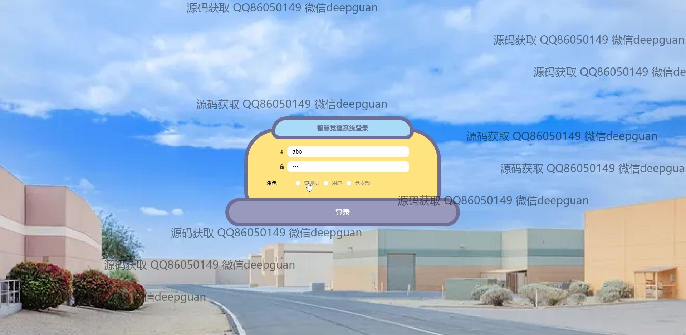

<h1 align="center">智慧党建系统</h1>

## 简介
智慧党建系统：角色分为管理员、用户、党支部；功能包括党支部管理、用户管理、入党申请管理、党建信息浏览与编辑、缴纳党费管理、学习心得记录，多角色支持与安全访问，提升党建工作效率。    --计算机毕业设计源码；毕设源码；java毕业设计源码

## 联系方式

<h3 align="center">获取完整代码与数据库文件 + 微信：deepguan QQ: 86050149 QQ群: 783742310</h3>

<h3 align="center">可帮忙远程部署 包运行成功！提供远程部署、修改代码、设计文档指导、代码讲解等服务！</h3>

## 功能介绍（完整见运行截图）
管理员： 基本功能包括登录和注册，退出登录功能确保信息安全。系统提供党支部管理，用户管理，入党申请管理功能，让管理员能够高效地管理党员和党支部信息。在个人中心，管理员可以查看和修改个人信息，进行账户设置。后台管理模块支持党建信息发布和学习资料管理，提供文件上传功能和党建活动组织管理，管理员可以通过系统查看和监管各种党务活动，确保信息的及时性和准确性。

用户： 用户可以通过系统账号登录以及注册新账号，实现个性化访问和信息管理。系统首页提供便捷的导航，用户能浏览党支部信息、获取学习资料、参与学习心得交流。个人中心允许用户查看和修改个人信息，管理入党申请和缴纳党费记录。学习模块提供了丰富的学习资料和成果分享功能，帮助用户提升学习效率与效果。用户也可以通过系统提供的支付功能来完成党费缴纳，实现便捷式财务管理。

## 运行截图

本代码来源于网络,仅供学习参考使用!

